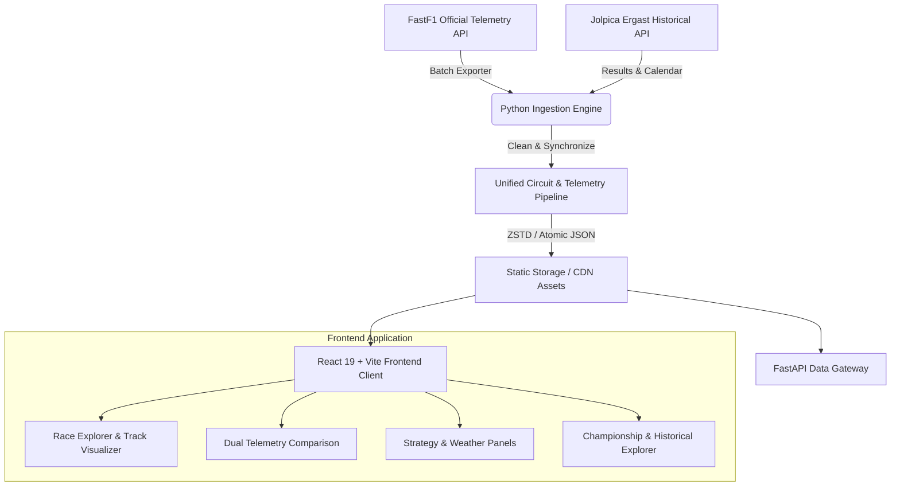

<div align="center">

# 🏎️ F1 Data Lab & Telemetry Suite

### Next-Generation Formula 1 Telemetry, Race Engineering & Historical Analytics Platform (1950 – 2025)

[](https://abhardwaj28.github.io/F1-telemetery-site/)
[](https://github.com/ABhardwaj28/F1-telemetery-site)
[](https://react.dev/)
[](https://www.typescriptlang.org/)
[](https://vitejs.dev/)
[](https://www.python.org/)
[](https://github.com/theOehrly/Fast-F1)

<p align="center">
  <b>Explore millisecond-accurate telemetry, synchronized circuit position scrubbers, head-to-head driver delta comparisons, tyre stint strategies, live race control feeds, and 75+ years of Formula 1 championship history.</b>
</p>

### 🔗 Live URL: [https://abhardwaj28.github.io/F1-telemetery-site/](https://abhardwaj28.github.io/F1-telemetery-site/)

---

[🚀 Quick Start](#-quick-start) • [✨ Key Features](#-key-features) • [📊 Analytics Modules](#-analytics-modules) • [🏛️ Architecture](#-system-architecture) • [🏎️ Telemetry Math](#-telemetry-math--physics) • [👨‍💻 Author](#-author)

</div>

---

## 🌟 Live Demo & Web App

Experience the full interactive dashboard live in your browser:
👉 **[Launch F1 Data Lab Live Dashboard](https://abhardwaj28.github.io/F1-telemetery-site/)**

> 💡 **Persistent State:** All views, selected years (1950–2025), grand prix rounds, practice/qualifying/race sessions, telemetry laps, and comparison drivers automatically persist in the URL and local storage across browser refreshes!

---

## ✨ Key Features

- 📍 **Interactive SVG Circuit Geometry & Turn Apex Mapping**: High-precision GPS track outlines with exact corner apex markers (T1–T20), distance splits, and track micro-sectors.
- ⚡ **Real-Time Synchronized Telemetry Scrubbing**: Move your cursor across the speed trace to inspect instantaneous speed, throttle %, brake pressure, gear, engine RPM, and DRS activation mapped directly to the car's real track position.
- ⚔️ **Head-to-Head Driver & Lap Comparison**: Superimpose Driver A vs Driver B (or compare personal best laps) with live **$\Delta t$ Delta Time curves** and corner-by-corner apex speed delta matrices.
- ⏱️ **True Race Strategy & Tyre Degradation**: Full tyre stint timelines (Soft, Medium, Hard, Intermediate, Wet) with pit stop lap tracking and lap-by-lap pace evolution curves.
- 🚦 **Synchronized Race Control Feed**: Chronological flagged incident logs, Safety Car deployments (SC / VSC), track status, and sector incidents synced with lap progression.
- 🌡️ **Atmospheric & Track Weather Monitoring**: Ambient temperature, track temperature, wind direction, wind speed, humidity, and precipitation indicators.
- 🏆 **Championship & Season Explorer**: Comprehensive Drivers' and Constructors' World Championship standings with interactive points progression across all 24 Grand Prix rounds.
- 📖 **Complete Historical F1 Archive (1950 – 2025)**: Technical regulation era breakdown (Ground Effect, Turbo-Hybrid, V8, V10, Classic) and All-Time Champions & records hall of fame.

---

## 📊 Analytics Modules

| Module | Icon | Description |
| :--- | :---: | :--- |
| **Race Explorer** | 🏁 | Comprehensive session view: Track map, Speed trace, Live readout HUD, telemetry scrubber, and session classification. |
| **Driver Comparison** | ⚔️ | Overlaid dual telemetry traces, delta time calculations ($\Delta t$), throttle/brake overlays, and apex corner speed differentials. |
| **Strategy & Laps** | ⏱️ | Real tyre stint progression timelines, pit stop windows, tyre compound wear, and lap time degradation curves. |
| **Race Control** | 🚦 | Incident feeds, Yellow/Red/Chequered flags, Virtual Safety Cars, and steward messages. |
| **Weather** | 🌡️ | Track temp, air temp, atmospheric pressure, wind vector, and rainfall indicators across sessions. |
| **Championship** | 🏆 | Drivers' and Constructors' World Championship standings with team branding and points share. |
| **Historical F1** | 📖 | Technical regulation eras (1950–2025) and all-time driver & constructor records. |

---

## 🏛️ System Architecture



### Monorepo Structure

```
F1-telemetery-site/
├── apps/
│   ├── web/                     # React + Vite + TypeScript Frontend
│   │   ├── src/
│   │   │   ├── components/      # UI components (TrackMap, SpeedTrace, DriverComparison, etc.)
│   │   │   ├── data/            # Centralized async data loaders & fallback engines
│   │   │   └── types.ts         # TypeScript data contracts & constants
│   │   └── public/data/         # Static assets (circuits, calendar, sessions, telemetry)
│   └── api/                     # FastAPI backend gateway
├── backend/
│   └── processors/              # Spatial coordinate alignment & corner mapping
├── packages/
│   └── data-model/              # Shared data models and schemas
├── pipelines/
│   ├── fastf1/                  # FastF1 telemetry & session extraction
│   └── jolpica/                 # Historical race results & calendar importer
└── scripts/                     # Automation & circuit generation utilities
```

---

## 🏎️ Telemetry Math & Physics

### Delta Time Calculation ($\Delta t$)
The time delta between Driver A ($v_A(s)$) and Driver B ($v_B(s)$) over track distance $x$ is computed using the spatial integration of inverse velocity:

$$\Delta t(x) = \int_{0}^{x} \left( \frac{1}{v_A(s)} - \frac{1}{v_B(s)} \right) ds$$

- **$\Delta t < 0$**: Driver A has gained time.
- **$\Delta t > 0$**: Driver B has gained time.

### Spatial Apex Correction
Corner locations are mapped against FastF1 `CircuitInfo` using minimum Euclidean distance and local velocity minimums to accurately place apex markers (T1–T20) along the true racing line.

---

## 🚀 Quick Start

### 1. Clone & Run Frontend

```bash
# Clone the repository
git clone https://github.com/ABhardwaj28/F1-telemetery-site.git
cd F1-telemetery-site

# Navigate to the web app
cd apps/web

# Install dependencies
npm install

# Start development server
npm run dev
```

Visit `http://localhost:5173` to explore the dashboard locally.

### 2. Build for Production

```bash
cd apps/web
npm run build
npm run preview
```

---

## 👨‍💻 Author

**Apoorva Bhardwaj**
- GitHub: [@ABhardwaj28](https://github.com/ABhardwaj28)
- Live Site: [https://abhardwaj28.github.io/F1-telemetery-site/](https://abhardwaj28.github.io/F1-telemetery-site/)

---

## 🛡️ License

This project is open-source under the [MIT License](LICENSE).

*Disclaimer: Formula 1, F1, and related marks are trademarks of Formula One Licensing B.V. This project is created for educational and analytical purposes.*
