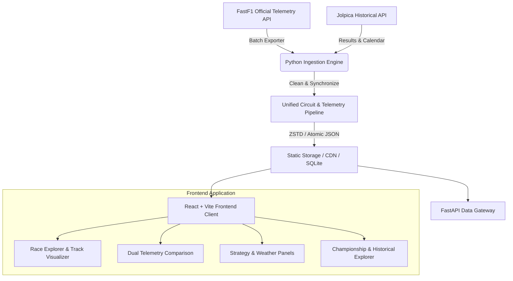

<div align="center">

# 🏎️ F1 DATA LAB

### Next-Generation Formula 1 Telemetry, Race Engineering & Historical Analytics Platform

[](https://reactjs.org/)
[](https://www.typescriptlang.org/)
[](https://vitejs.dev/)
[](https://www.python.org/)
[](https://github.com/theOehrly/Fast-F1)
[](https://fastapi.tiangolo.com/)

<p align="center">
  <b>Explore millisecond-accurate telemetry, synchronized track positions, live driver comparisons, tyre stint strategies, and championship progression.</b>
</p>

[Key Features](#-key-features) • [Architecture](#-architecture) • [Getting Started](#-getting-started) • [Modules & Views](#-modules--views) • [Data Pipeline](#-data-pipeline--compression)

</div>

---

## ✨ Key Features

- 📍 **Real Circuit Geometry & Turn Mapping**: Unified SVG circuits with exact GPS coordinates, corner apex markers (T1–T20), distance splits, and track sectors.
- ⚡ **Synchronized Telemetry Scrubbing**: Move your cursor along the speed trace to inspect car location, instantaneous speed, throttle %, braking pressure, gear, RPM, and DRS status in real time.
- ⚔️ **Head-to-Head Driver Comparison**: Superimpose Driver A vs Driver B (or compare different laps) with live **$\Delta t$ Delta Time traces** and corner-by-corner apex speed delta matrices.
- ⏱️ **Race Strategy & Tyre Degradation**: Full tyre stint timelines (Soft, Medium, Hard, Intermediate, Wet) and lap-by-lap pace evolution curves for all drivers.
- 🚦 **Live Race Control Feed**: Real-time flagged incident logs, Safety Car deployments (SC / VSC), track status, and sector incident timelines.
- 🌡️ **Atmospheric & Track Weather Monitoring**: Ambient temperature, track temperature, wind direction/speed, humidity, and rainfall indicators.
- 🏆 **Championship & Season Explorer**: Comprehensive Drivers' and Constructors' World Championship standings with points share visualizers across all 24 Grand Prix rounds.
- 📖 **Historical F1 Archive (1950 – 2025)**: Technical regulation era breakdown (Ground Effect, Turbo-Hybrid, V8, V10, Classic) and All-Time Champions & records hall of fame.

---

## 🏛️ System Architecture



### Clean Layered Monorepo

```
f1-data-lab/
├── apps/
│   ├── web/                     # React + Vite + TypeScript Frontend
│   │   ├── src/
│   │   │   ├── components/      # UI components (TrackMap, SpeedTrace, DriverComparison, etc.)
│   │   │   ├── data/            # Centralized async data loaders & fallback handlers
│   │   │   └── types.ts         # TypeScript data contracts & constants
│   │   └── public/data/         # Static assets (circuits, calendar, sessions, telemetry)
│   └── api/                     # FastAPI backend gateway
├── backend/
│   └── processors/              # Spatial coordinate alignment & corner mapping
├── packages/
│   └── data-model/              # Shared data models and schemas
├── pipelines/
│   ├── fastf1/                  # FastF1 telemetry & session extraction
│   └── jolpica/                 # Historical race results & calendar importer
└── scripts/                     # Automation & circuit generation utilities
```

---

## 🚀 Getting Started

### Prerequisites
- **Node.js**: `v18.0.0` or higher
- **Python**: `3.10` or higher

### 1. Frontend Setup & Run

```bash
# Navigate to web application
cd "apps/web"

# Install dependencies
npm install

# Start local dev server
npm run dev
```
Open **`http://localhost:5173`** in your browser.

### 2. Python Pipeline & API (Optional)

```bash
# Create and activate virtual environment
python3 -m venv .venv
source .venv/bin/activate

# Install requirements
pip install -e .

# Run FastF1 data extraction
python scripts/generate_all_circuits.py

# Launch FastAPI service
uvicorn apps.api.f1_api.main:app --reload --port 8000
```

---

## 📊 Modules & Views

| View | Icon | Description |
| :--- | :---: | :--- |
| **Race Explorer** | 🏁 | Comprehensive session view: Track map, Speed trace, Live readout HUD, and session classification. |
| **Driver Comparison** | ⚔️ | Overlaid dual telemetry traces, delta time calculations ($\Delta t$), and apex corner speeds. |
| **Strategy & Laps** | ⏱️ | Tyre stint progression timelines, pit-stop windows, and lap time degradation graphs. |
| **Race Control** | 🚦 | Incident feeds, Yellow/Red/Chequered flags, Virtual Safety Cars, and steward messages. |
| **Weather** | 🌡️ | Track temp, air temp, atmospheric pressure, wind vector, and rainfall indicators. |
| **Championship** | 🏆 | Drivers' and Constructors' World Championship standings with team branding. |
| **Historical F1** | 📖 | Technical regulation eras (1950–2025) and all-time driver & constructor records. |

---

## 🏎️ Telemetry & Physics Engineering

### Delta Time Calculation
The time delta between Driver A ($v_A(x)$) and Driver B ($v_B(x)$) over track distance $x$ is computed via:

$$\Delta t(x) = \int_{0}^{x} \left( \frac{1}{v_A(s)} - \frac{1}{v_B(s)} \right) ds$$

- **$\Delta t < 0$**: Driver A has gained time.
- **$\Delta t > 0$**: Driver B has gained time.

### Spatial GPS Correction
Corner locations are matched against FastF1 `CircuitInfo` using minimum Euclidean distance and local velocity minimums to accurately place apex markers (T1–T20) along the true racing line.

---

## 📦 Data Pipeline & Compression

To ensure fast load times and scale to 20+ years of Formula 1 data:
1. **No Live FastF1 in Browser**: Telemetry is processed offline into lightweight, pre-aligned JSON/Parquet assets.
2. **On-Demand Loading**: Telemetry for individual laps is fetched asynchronously only when requested.
3. **CDN-Ready**: All assets in `public/data/` can be deployed to Cloudflare R2, AWS S3, or GitHub Pages.

---

## 🛡️ License

This project is open-source under the [MIT License](LICENSE).

*Disclaimer: Formula 1, F1, and related trademarks are properties of Formula One Licensing B.V. This project is for educational and analytical purposes.*
